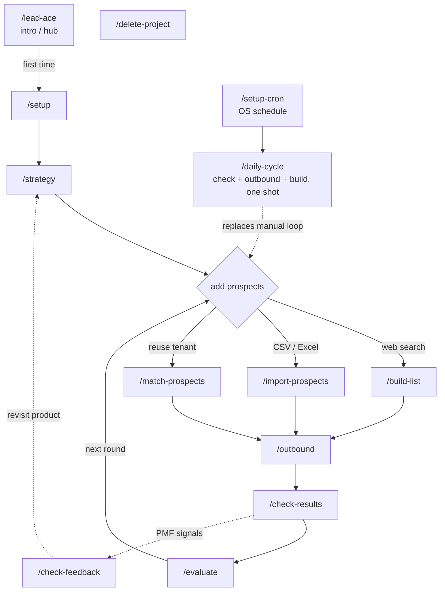

# lead-ace

Autonomous lead generation plugin for Claude Code.
Builds prospect lists, runs outbound outreach, and iterates on strategy — all hands-free.

> **Two ways to run it.** Use the hosted service at [app.leadace.ai](https://app.leadace.ai) (Free tier — 5 outreach/day, paid plans from $29/mo), or [self-host](docs/self-host.md) the backend on your own Cloudflare + Supabase. The plugin is the same in either case — point it at the hosted MCP or your own.

## For Users

### Prerequisites

- Claude Code
- A LeadAce account at https://app.leadace.ai (Free tier — no card)
- Gmail MCP — for sending and checking emails
- claude-in-chrome MCP — for form filling and SNS DMs

### Installation

In Claude Code:

```
/plugin marketplace add aitit-inc/lead-ace
/plugin install lead-ace@lead-ace
```

To update later:

```
/plugin marketplace update
/plugin update lead-ace@lead-ace
```

### Sign in to LeadAce

The first time the plugin calls a LeadAce tool, your browser opens for OAuth
sign-in to Supabase (the same email and password as the web app). The token is
cached locally for subsequent runs. See [plugin/README.md](plugin/README.md)
for details and troubleshooting.

### Usage

The first argument to every command is your project name (chosen at `/setup`).

| Command | Purpose |
|---|---|
| **Setup** | |
| `/lead-ace` | Intro / hub — first-time orientation, version, skill list |
| `/setup <name>` | Create a LeadAce project + verify env (MCP, Gmail, local tools) |
| `/strategy <name>` | Define / update sales & marketing strategy |
| **Add prospects** (pick one) | |
| `/build-list <name>` | Web search for new prospects |
| `/import-prospects <name>` | Load CSV / Excel / SQLite |
| `/match-prospects <name>` | Reuse prospects already in your tenant |
| **Sales loop** | |
| `/outbound <name>` | Send via email, contact forms, SNS DMs |
| `/check-results <name>` | Collect Gmail + SNS replies → DB |
| `/evaluate <name>` | PDCA — analyse, auto-improve strategy, and surface tactical rejection signals (recontact queue, decision-maker referrals, targeting hints) |
| **Reflection** | |
| `/check-feedback <name>` | Surface PMF signals from rejection feedback (feature gaps, competitor presence) — ad-hoc product reflection |
| **Automation** | |
| `/daily-cycle <name> [count]` | One-shot bundle: check-results → evaluate → outbound + build-list |
| `/setup-cron <name>` | Schedule `/daily-cycle` on the OS (LaunchAgent / Task / cron) |
| **Maintenance** | |
| `/delete-project <name>` | Permanently delete a project and all its data |

Projects, prospects, outreach logs, and strategy documents live in the cloud
— there are no local files to manage. Review everything in the web app at
https://app.leadace.ai.

### Flow



Solid arrows = the main loop. Dashed = optional / occasional / wrapper.
`/evaluate` also consumes the tactical slice of rejection feedback (recontact requests, decision-maker referrals, `not_relevant` industry clusters) recorded by `/check-results` — no separate user step.

---

## License

This plugin is provided under a proprietary license by SurpassOne Inc.

- **Free tier:** 1 project, 500 prospects, 5 outreach actions per day (50 lifetime cap)
- **Paid plans** start at $29/month. Manage your subscription from the web app.
- **Self-host:** see [docs/self-host.md](docs/self-host.md) — running for your
  own use is allowed; redistributing as a hosted service to others is not.

---

## For Developers

### Repository layout

```
plugin/                          # Claude Code plugin
├── .claude-plugin/plugin.json   # Manifest
├── .mcp.json                    # MCP server config (uses LEADACE_MCP_URL)
├── skills/                      # Slash commands (each directory has SKILL.md)
├── scripts/fetch_url.py         # Local web fetch helper
└── references/                  # Shared reference docs
backend/                         # API + MCP servers (Cloudflare Workers, Hono, Drizzle)
frontend/                        # Web app (SvelteKit, Cloudflare Pages)
docs/                            # Project-wide docs (deploy runbook, self-host, architecture)
docker-compose.yml               # Bare Postgres for non-Supabase local dev
```

- Plugin conventions and the schema-change workflow: [CLAUDE.md](CLAUDE.md)
- Production deploy runbook: [docs/deploy.md](docs/deploy.md)
- Self-hosting and local dev: [docs/self-host.md](docs/self-host.md)

### Quick start (local dev)

```bash
npx supabase start                      # Auth + Postgres on ports 54321/54322
cd backend
cp .dev.vars.example .dev.vars          # then edit with `supabase status` values
npm install
npm run db:migrate
npx tsx scripts/seed-master-documents.ts

npm run dev:api                         # API → http://localhost:8787
npm run dev:mcp                         # MCP → http://localhost:8788  (separate terminal)

cd ../frontend
cp .env.example .env                    # set VITE_SUPABASE_* from `supabase status`
npm install
npm run dev                             # → http://localhost:5173
```

Pre-release checks:

```bash
cd backend && npm run typecheck
cd frontend && npm run check
```
